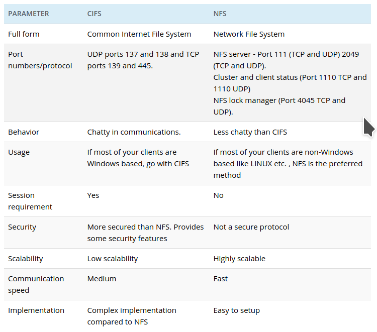

 ### CIFS vs SMB vs NFS
 
 
 
 - **CIFS**
 
 CIFS is abbreviated as a “Common internet file system”. It was first created by Microsoft and then enhanced by IBM. In simple words, we can say that to transfer a file over a network or server. CIFS is a very safe and authenticated file transfer protocol system. It is an Open platform for requesting file transfer over the server. CIFS is basically an enhanced or improvised version of Server Message Block (SMB) for file sharing. CIFS is also a combined sharing of multiple devices like files, printers, etc. among the clients to access the data over the network.

Below are a few important features of CIFS:

 - Authenticated file transfer protocol.
 - High Performance and feasible usage of the file transfer protocol.
 - Allows editing the files over the network.
 - Multiple users can access the data over the network without any issues at the server level.

 
 - **SMB**
 
 SMB is abbreviated as “Server Message Block” which is also similar to CIFS that shares a network to transfer the file. Initially, it was enhanced by IBM for an improvised version of CIFS. SMB allows the client to edit, read, and write over the file on a server. This server is referred to as LAN (Local Area Network). SMB was introduced to edit the files over the local area network to share among the clients in a safer and feasible way.

With different versions of SMB, the performance level has also increased. Below are the important features of SMB:

 - SMB provided an authenticated intercommunication process mechanism.
 - SMB provides the clients to share the file, browse the network, print services, etc over the network.
 - SMB version 2 has reduced the usage of the number of commands and subcommands used to transfer the file over the network.
 - SMB2 includes the support for symbolic links as an enhanced version of SMB version 1.

 
 - **NFS**
 
 NFS is the “Network File System” for Unix and Linux operating systems. It allows files to be shared transparently between servers, desktops, laptops etc. It is a client/server application that allows a user to view, store and update files on a remote computer as though they were on their own computer. Using NFS, the user or a system administrator can mount all or a portion of a file system.
 
 
 
 
 
 
 
- **AFP**

AFP is clearly superior to SMB or NFS for Mac OS 8.1-OS X 10.8 clients

AFP is the native file and printer sharing protocol for Macs and it supports many unique Mac attributes that are not supported by other protocols. So for the best performance, and 100% compatibility, AFP should be used.
 
 
 

### distributed storage detaylı anlatımlar 

- [ceph](ceph.md)
- [minio](minio.md)
- [gluster](gluster.md)
- [iops](iops.md)
- [Windows Storage System](WindowsStorage.md)
- [sata, para, sas, scsi, iscsi](sas_scsi_iscsi_sata_pata_esxi.md)
- [fuse - posix](FUSE_POSIX.md)


### windows üzerinde samba testi. 
 
 [kaynak](https://docs.microsoft.com/en-us/windows-hardware/drivers/debugger/file-share--smb--symbol-server)
 
 aynı makinada \MachineName\Symbol paylaştırılmış path i C:\Symbols  atında samb aile bağlıymış gibi test etmek
 
 ```
 srv*C:\Symbols*\\MachineName\Symbols
 ```

### Ceph Kurumları

- [Ansible İlk Deneme : Octobus desteği ansible a tam gelmeden önce deneme yapmıştım](installation/installation.md)

- [Hardway Full Manuel Kurulum](installation2/readme.md)

- [Cephadm ile kurulum](installation2/readme.md)

- [Ansible Octobus Ceph 15 - Ubunut 20.04 kurulumu](installation4/readme.md)


